# Как пользоваться сервисами Classroom и GitHub

## Данное руководство пригодится для всех тех, кто сдаёт домашние задания по АИПу

### Как получить доступ к GitHub репозиторию через Google Classroom?

Для начала нужно открыть [Google Classroom](https://classroom.google.com "Тыкай")

Выбрать в [Google Classroom](https://classroom.google.com "Тыкай") курс с АиП

Выбрать вкладку с заданиями
> Здесь у Вас будут отображаться все задания с этого курса с отображением всех дедлайнов
 
После выбора любого задания у Вас появится примерно такой результат на экране

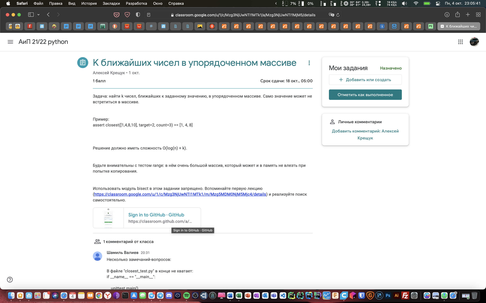

Нам необходимо перейти по ссылке GitHub для создания личного репозитория

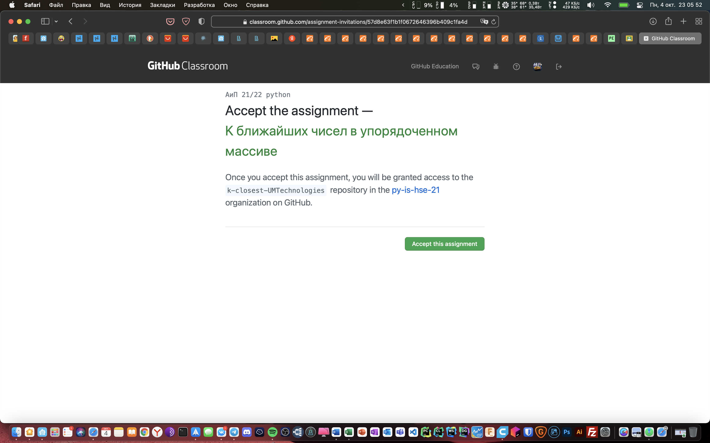

Соглашаемся (<span style="color:green">Accept the assignment</span>)
> Если Вы не зашли в этом браузере в GitHub, то возможно потребуется ввести логин и пароль от вашей страницы GitHub (необязательно использовать студенческую учётную запись)


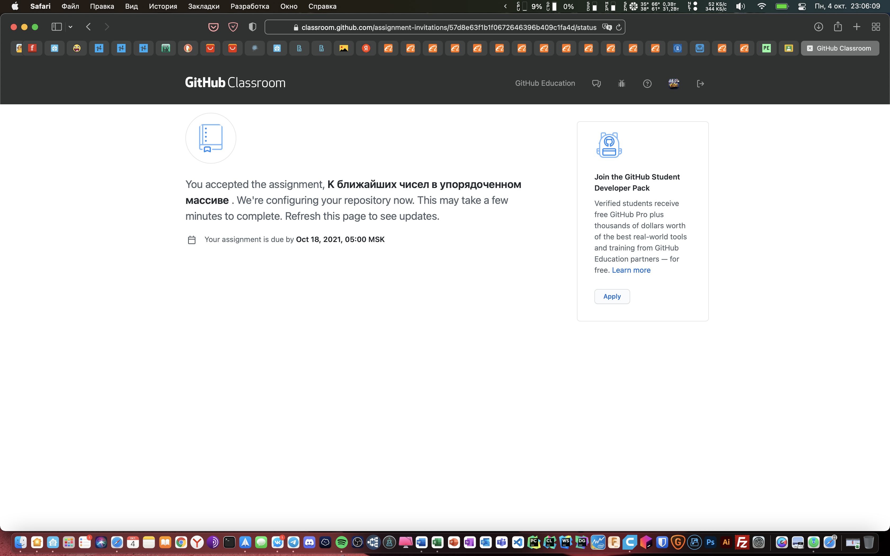

Ждём пару минут пока создаётся репозиторий для нашего задания

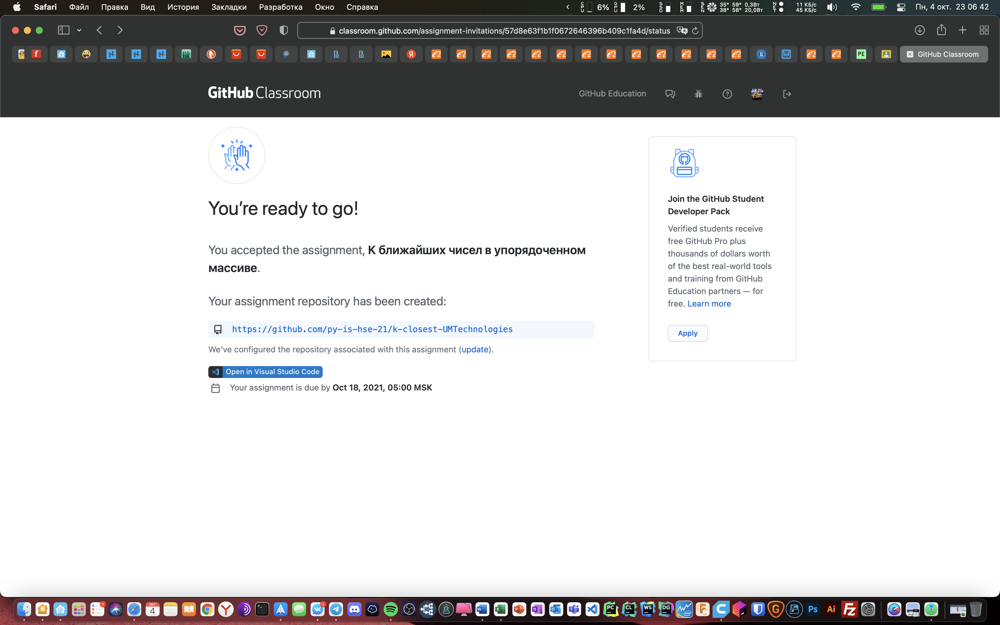

После того как репозиторий создался, Вы можете перейти по <span style="color:blue">синей ссылке</span> в созданный репозиторий GitHub

---

### Как скачать репозиторий с [GitHub](http://github.com)

Для этого мы нажимаем кнопку <span style="color:green">Code</span> и в выпадающем окне копируем ссылку https (нажмите на кнопку справа от ссылки для быстрого копирования)

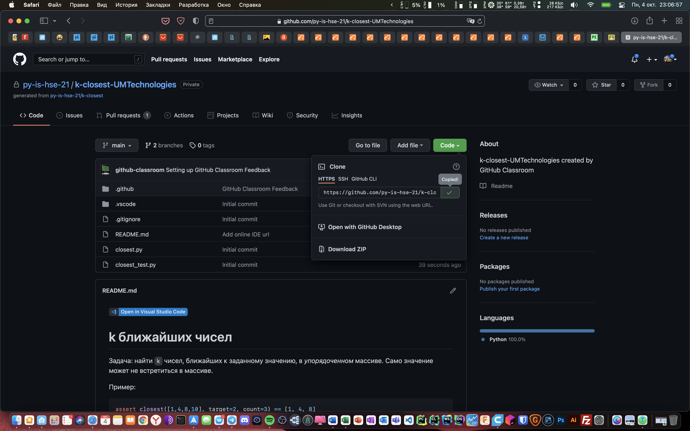

Далее необходимо запустить программу **Терминал** (Mac OS/Linux) или **Командная строка** (Windows)

> Предварительно необходимо скачать [GIT](https://git-scm.com/downloads) 
>> Apple Mac os сам предложит скачать систему контроля версий 
>>> Необходимо лишь в командной строке набрать git
> 
>> На некоторых дистрибутивах Linux GIT можно использовать из коробки
> 
Прежде чем клонировать репозиторий нам надо выбрать директорию (папку) куда мы будем устанавливать репозиторий
> Название популярных директорий компьютеров разных OS
>> Desktop - рабочий стол
>> Documents - документы
>> Downloads - загрузки
>>> Команда для просмотра главных директорий в терминале или в командной строке
>>>  ```ls```
> 
```
cd Documents
```
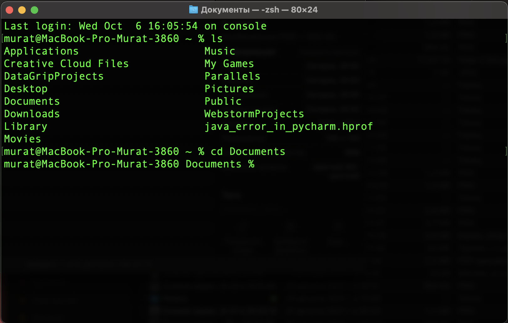

В командную строку набираем git clone [ссылка на репозиторий]

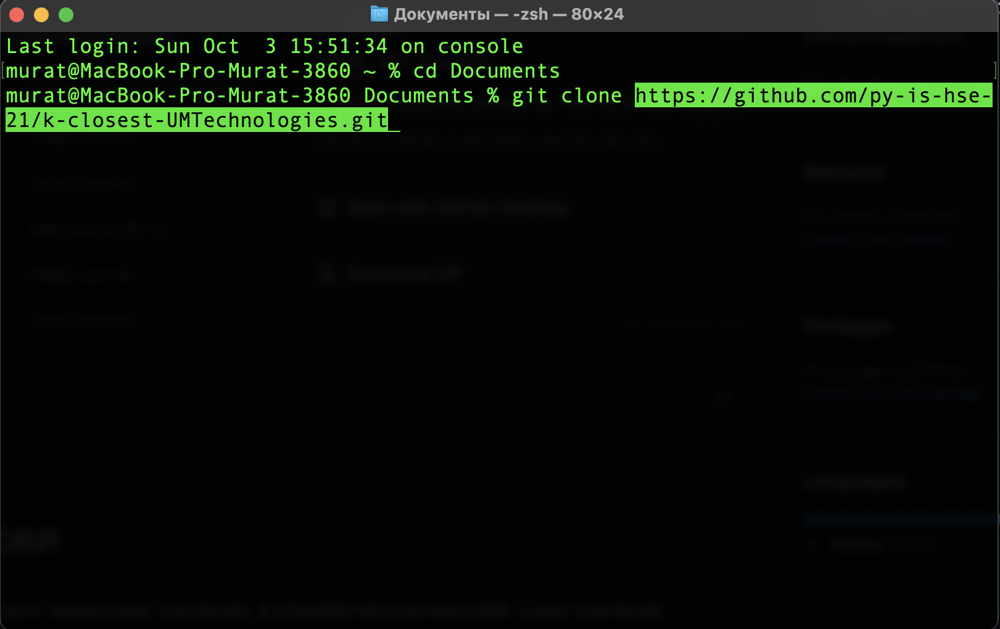

```
git clone https://github.com/py-is-hse-21/rna-UMTech.git
```

При успешном клонировании у вас появиться репозиторий на диске

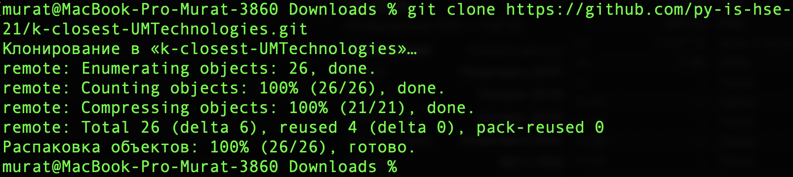
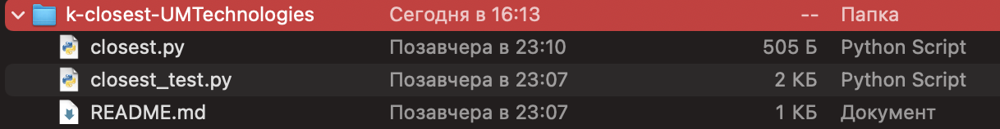

### Как открыть репозиторий в [PyCharm](https://www.jetbrains.com/pycharm/)

>PyCharm — интегрированная среда разработки для языка программирования Python.
>> Благодаря студенческому билету Вы можете получить Pycharm PRO
> 
>> Или воспользоваться бесплатной версию Pycharm Community 

File -> Open -> *выбираем наш репозиторий*

Вуаля

### Как решить задание

Смотрим лекции по АиПу и посещаем семинары

> Решать таск нельзя в файле с названием название-файла_test

Вуаля

### Как сохранить задание

После того как репозиторий будет создан, вам нужно добавить свои файлы в него. Каждый файл нужно добавлять отдельно или сказать утилите, что необходимо добавить все файлы явно. Пока вы не добавите файл сам он не будет отслеживаться. Новые файлы в будущем тоже нужно добавлять, они не добавляются автоматически.

```
git add .
```

> Данная команда добавляет все файлы для индексации
>> Если нужно (например) только два файла индексировать, то нужно набрать
>> ```git add [файл] [файл]``` без запятых через пробел
>>> Команда ```git status``` показывает какие файлы индексированы (<span style="color:green">файлы отображаются зелёным цветом</span>) и какие не добавлены в индексацию (<span style="color:red">файлы отображаются красным цветом</span>)
>>>  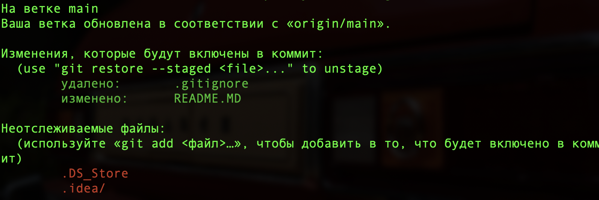
> 
Изменения тоже автоматически не отслеживаются. Фиксация изменений выполняется с помощью команды commit. Вам нужно указать что было изменено с помощью небольшого комментария, буквально в несколько предложений. Хорошая практика выполнять фиксацию перед каждым серьезным изменением.

Таким образом, вы будете хранить все версии проекта, от самой первой и до текущей, а также сможете знать что, когда и где было изменено. Чтобы создать коммит выполните:

```
git commit -m "Engine created"
```

До этого момента мы делали все в локальном репозитории. Вы можете использовать git локально, если нужен только контроль версий, но в нашем случае нам необходимо загрузить решение в GitHub. Для этого используем команду ниже для отправки изменений на сервер

```
git push
```

Задание успешно залили на сервер

### Что нужно сохранить в [Google Classroom](https://classroom.google.com "Тыкай")

Нужно сдать ссылку на ваш репозиторий вида https://github.com/py-is-hse-21/kapli-[ваш логин на github] (которую мы использовали для клонирования репозитория). В качестве названия этой ссылки google покажет Page not found, и это правильно.

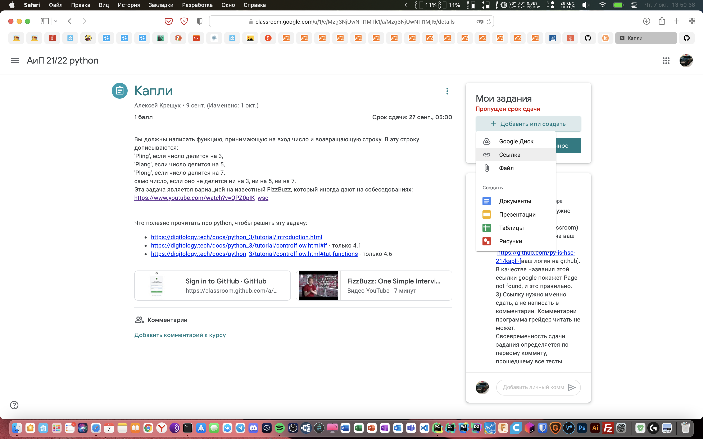
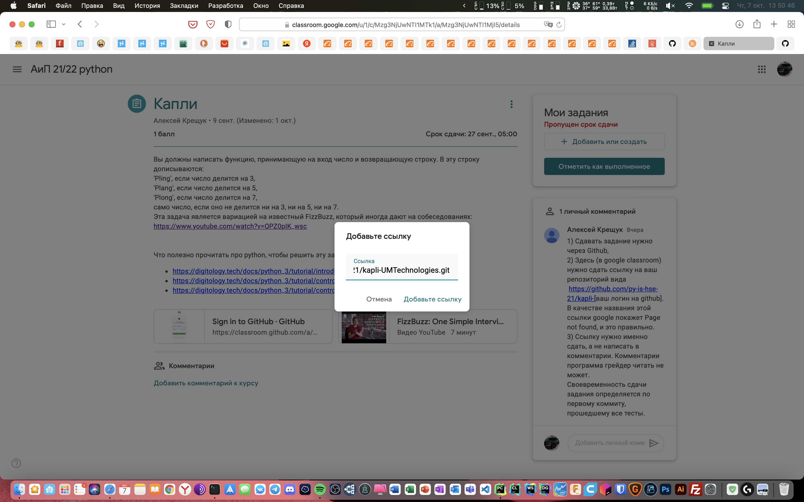
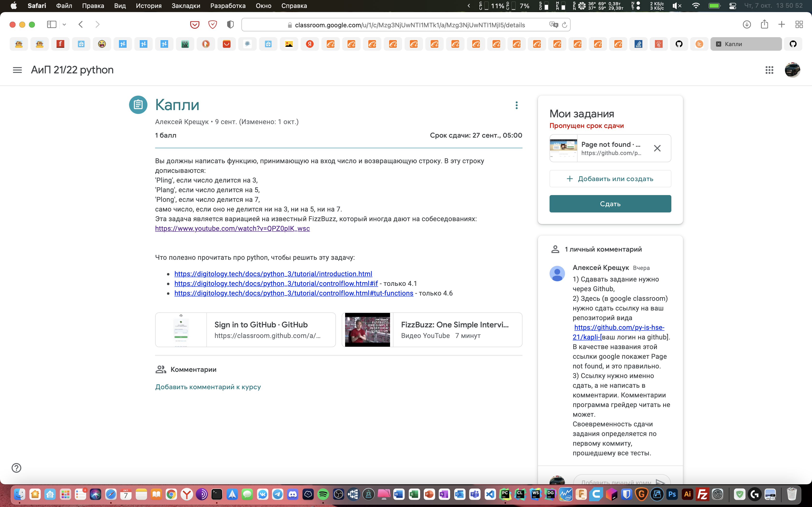

#### Полезные команды для Git

<span style="color:orange">$ git</span> <span style="color:purple">опции</span> <span style="color:blue">команда</span> <span style="color:brown">аргументы</span>

<span style="color:purple">Опции</span>:
- -C - использовать указанную папку репозитория вместо текущей папки;
- -c параметр=значение - использовать указанное значение параметра конфигурации;
- -p - прокручивать весь вывод с помощью less;

<span style="color:blue">Основные команды:</span>
- add - добавить файл или папку в репозиторий git;

- archive - создать архив файлов;
- bisect - использовать бинарный поиск для поиска нужного коммита;
- branch - управление ветками проекта;
- bundle - перемещение объектов и ссылок в архиве;
- checkout - переключение между ветками;
- cherry-pick - внести изменения в уже существующие коммиты;
- clean - удалить все неотслеживаемые файлы и папки проекта;
- clone - создать копию удаленного репозитория в папку;
- commit - сохранить изменения в репозиторий;
- diff - посмотреть изменения между коммитами;
- fetch - скачать удаленный репозиторий;
- init - создать репозиторий;
- merge - объединить две ветви;
- pull - интегрировать удаленный репозиторий с локальным;
- push - отправить изменения в удаленный репозиторий;
- tag - управление тегами;
- worktree - управление деревями разработки.

